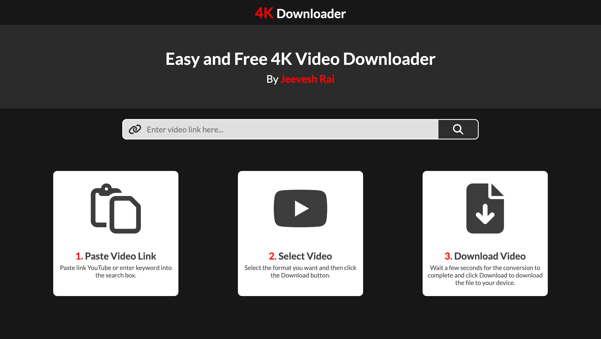
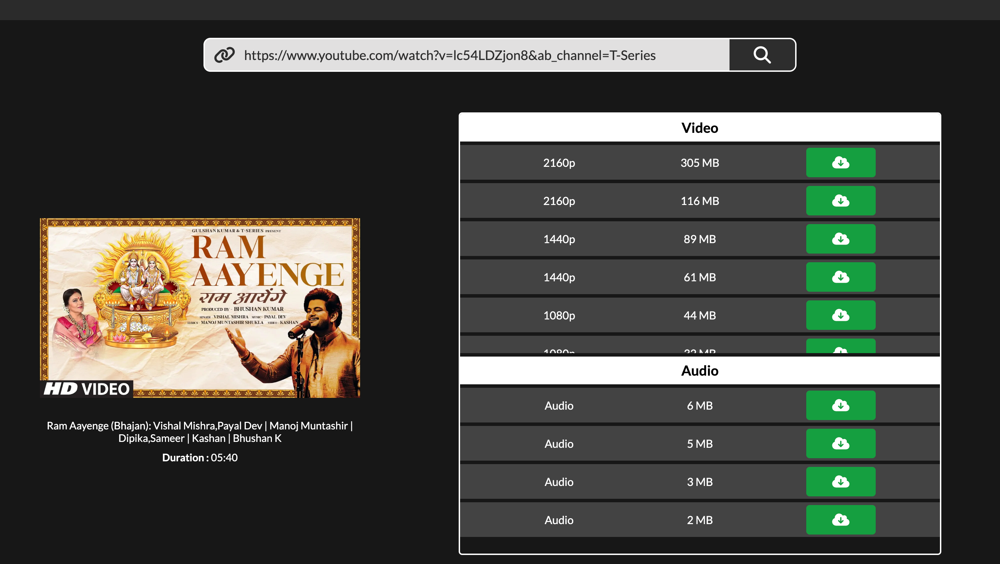
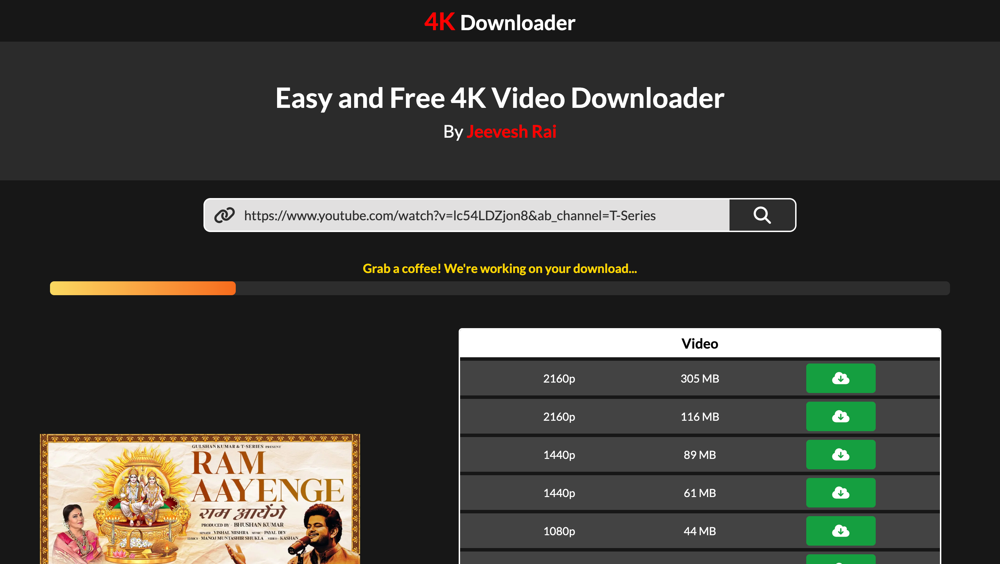

    
    <h1>4K Youtube Video Downloader</h1>
    
4K Youtube Downloader is your go-to solution for enjoying YouTube videos offline in the highest clarity possible.

---

  
  
  

## Features 🚀
- ✅ Incredible Download Speeds
- ✅ All Quality Options
- ✅ Separate Audio and Video Downloads

## Website Link 🔗
<a href="https://jrytdl.netlify.app/" target="_blank" style="text-decoration: none; padding: 10px 20px; background-color: #4CAF50; color: #fff; border-radius: 5px; font-weight: bold; display: inline-block; margin-top: 10px;">Visit the 4K Youtube Downloader</a>

## Disclaimer ℹ️
This project and its contents are not affiliated with, funded, authorized, endorsed by, or in any way associated with YouTube, Google LLC, or any of its affiliates and subsidiaries.

Any trademark, service mark, trade name, or other intellectual property rights used in this project are owned by the respective owners.
